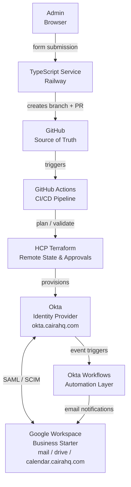

# Caira HQ — Platform

Caira HQ is a personal infrastructure lab built and managed as a real organization on `cairahq.com`. This repository documents the platform layer: identity, access management, collaboration tooling, and automation, as it is built out.

The goal is not a sandbox of isolated experiments. It is a functioning, production-style environment designed around the same principles and tooling used at modern SaaS companies: identity as the control plane, automation as the default, and infrastructure managed as code.

---

## Why This Exists

My production experience spans Google Workspace, Entra ID, Microsoft 365, Azure, Active Directory, and Windows OS/macOS fleet management across multiple MSP clients. This lab exists to build and demonstrate hands-on depth in the tools and patterns that SaaS and platform engineering teams actually run: Okta, Google Workspace, Terraform, cloud infrastructure, applied in a real, working environment rather than documented in isolation.

Everything in this repo has been built, tested, and is actively running on `cairahq.com`.

---

## Architecture

**Current stack:**

| Layer | Tool | Purpose |
|-------|------|---------|
| Source Control | GitHub | Infrastructure as code, GitOps workflow |
| CI/CD Pipeline | GitHub Actions | Automated plan, validate, and apply on PR/merge |
| Remote State & Approvals | HCP Terraform | State management, run history, manual apply gate |
| Infrastructure as Code | Terraform | User provisioning, Okta resource management |
| Identity Provider | Okta Integrator Free Plan | SSO, MFA, SCIM provisioning, security policies |
| Automation | Okta Workflows | Event-driven automation: user lifecycle notifications |
| Lifecycle Management | TypeScript + Express | Web UI and GitHub API glue for onboarding and offboarding |
| Hosting | Railway | Production deployment of TypeScript service |
| Collaboration | Google Workspace Business Starter | Email, Drive, Calendar |
| DNS | GoDaddy | Domain and subdomain management |
| Custom Domain | okta.cairahq.com | Okta tenant custom domain |
| Vanity URLs | mail / drive / calendar.cairahq.com | Google Workspace service shortcuts |

---

## Platform Layers

### Identity
The identity layer is built on Okta as the IdP, federating with Google Workspace via SAML 2.0. Users are provisioned automatically into Google Workspace via SCIM. Security policies follow NIST 800-63B principles: no password expiration, MFA required, session lifetimes aligned to risk tier.

→ [Identity layer documentation](./identity/README.md)

### Infrastructure as Code
Okta resources are managed via Terraform using the Okta provider. Terraform defines the desired state: users, group membership, and app assignments are declared as code and applied to Okta. Okta is the runtime source of truth for identity, with SCIM handling downstream propagation to Google Workspace. No users are created directly in Google.

All Terraform changes flow through a GitOps pipeline: branch, pull request, automated checks, human approval, and automated apply via HCP Terraform. State is stored remotely in HCP Terraform.

Provisioning requests originate from the TypeScript onboarding service, which creates branches and opens PRs automatically. Terraform remains the only system that touches Okta directly.

→ [Terraform documentation](./terraform/README.md)

### Automation
The automation layer has two components: event-driven notifications via Okta Workflows, and a user lifecycle management service built in TypeScript.

**Okta Workflows — identity event automation:**

| Flow | Trigger | Action |
|------|---------|--------|
| New User - Admin Notification | User created in Okta | Emails admin@cairahq.com with new user's name, email, title, department, manager, and user type |
| New User - Welcome Email | User created in Okta | Emails the new user with login details and IT contact information |
| User Offboarded - Admin Notification | User deactivated in Okta | Emails admin@cairahq.com with offboarded user's details and a reminder to complete offboarding steps |

**TypeScript Service — lifecycle management UI:**

A web-based onboarding and offboarding form hosted on Railway. Admins fill in user details, the service reads the current `users.csv` from GitHub, updates it, creates a branch, commits the change, and opens a PR automatically. Terraform provisions the user on merge. Basic auth protects the form. Production upgrade path is Okta SSO.

→ [Workflows documentation](./workflows/README.md)

---

## Design Principles

**Identity is the control plane.** Access to every service flows through Okta. No direct Google password auth for standard users: every login is an Okta-authenticated session.

**Infrastructure managed as code.** Okta users, groups, and policies are defined in Terraform. Manual configuration is documented and exists only where provider support is unavailable. The goal is a repo that reflects the actual running state of the environment.

**GitOps as the change model.** All infrastructure changes flow through Git. No direct console access to create or modify resources: everything is declared in code, reviewed via pull request, and applied through the pipeline. Every change has a complete audit trail.

**Automation as the default.** Identity events drive automated actions. User provisioning triggers welcome emails and admin notifications without manual intervention. The goal is zero-touch lifecycle management: every joiners, movers, and leavers action handled by the system, with humans involved only for approval gates.

**Okta is the source of truth.** Users are provisioned in Okta and pushed downstream via SCIM. Nothing is created directly in Google Workspace or any other service. This keeps offboarding clean and prevents config drift across systems.

**NIST 800-63B alignment.** Password policy follows current NIST guidance: no arbitrary expiration, minimum length over complexity requirements, breach detection enabled, MFA required as a compensating control.

**Document the decisions, not just the steps.** Every configuration in this repo includes the reasoning behind it: threshold calculations, policy tradeoffs, known limitations, and production recommendations where the lab environment has constraints.

**Build vs buy.** Where battle-tested open-source tools exist, use them. Where custom scripting adds genuine value, write it. Never build what already exists just to have code to show.

---

## Relationship to Infrastructure Portfolio

This repo is the applied environment. The [`infrastructure-portfolio`](https://github.com/neilchvz/infrastructure-portfolio) repo contains the reusable scripts, modules, and tooling used to build and manage this platform.

- **infrastructure-portfolio** → the toolbox
- **cairahq-platform** → the toolbox in production

---

## Status

| Component | Status |
|-----------|--------|
| Google Workspace tenant | ✅ Live |
| Okta tenant | ✅ Live |
| SAML SSO federation | ✅ Working |
| Custom domain (okta.cairahq.com) | ✅ Live |
| Vanity URLs (mail / drive / calendar) | ✅ Live |
| SCIM provisioning | ✅ Configured |
| Security policies (MFA, password, session) | ✅ Configured |
| Terraform — Okta provider | ✅ Live |
| GitHub Actions CI/CD pipeline | ✅ Live |
| HCP Terraform remote state | ✅ Live |
| Okta Workflows | ✅ Live |
| TypeScript onboarding/offboarding service | ✅ Live |
| Railway hosting | ✅ Live |
| Endpoint management — FleetDM | 🔲 Planned |
| App-level authentication policies | 🔲 Planned — pending FleetDM integration |

---

Neil Chavez · Creator of things.
