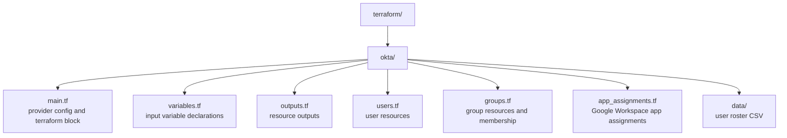

# Terraform

This directory contains Terraform configurations for managing Caira HQ infrastructure as code. Okta is the primary resource target — users, groups, app assignments, and policies are declared here and applied via the Okta provider.

Terraform defines desired state. Okta owns runtime identity. SCIM handles downstream propagation to Google Workspace.

---

## Structure



---

## Usage

### Prerequisites

- [Terraform](https://developer.hashicorp.com/terraform/install) >= 1.0
- Okta API token with sufficient privileges (super admin or custom role with user/group/app management)

### Authentication

The Okta API token is passed via environment variable and never stored in code or committed to the repo:

```bash
export TF_VAR_okta_api_token="your-api-token"
```

### First Run

```bash
cd terraform/okta
terraform init
terraform plan
terraform apply
```

### Adding a New User

Add a row to `data/users.csv` and run `terraform apply`. No code changes required.

---

## User Provisioning

User data is managed via `data/users.csv` rather than hardcoded Terraform resources. Each row represents one user. Terraform reads the CSV and dynamically creates one Okta user resource per row using `for_each`.

This pattern simulates a real HRIS integration — in production, this data would be sourced from an API call to BambooHR, Workday, Rippling, or similar. The CSV is the lab equivalent of that data source.

The CSV includes an intentional subset of user fields — name, login, email, title, and manager. Fields like personal email and phone number are excluded from this public repository as they constitute PII. In a production HRIS integration these fields would be sourced from the HRIS API directly and would never touch a committed file.

Users are created as ACTIVE with a temporary password set via `var.default_temp_password`. The user is forced to change their password on first login. The admin communicates the temporary password to the user directly — no activation email is required or sent.

---

## State

Local state is used in this lab environment. In production, state would be stored remotely — Terraform Cloud, S3 with DynamoDB locking, or similar — to support collaboration, state locking, and audit history.

The `terraform.tfstate` file and any `.tfvars` files are gitignored and never committed.

---

## Design Decisions

**CSV as HRIS simulation.** User data lives in `data/users.csv` rather than hardcoded variables. Adding a user means adding a row — no code changes. This mirrors how production environments source user data from an HRIS system, keeping the provisioning code generic and the data separate.

**Okta as the identity source of truth.** All user accounts are created and managed in Okta via Terraform. No users are provisioned directly in Google Workspace or any downstream service — that is handled by SCIM after Okta receives the resource.

**Single group for SSO and SCIM.** The `Google Workspace SSO/SCIM` group handles both app access and SCIM provisioning. A single group keeps membership management simple in a single-operator environment — one group assignment covers both access and provisioning. In a larger environment these would be separated to allow finer-grained control over who gets provisioned vs who gets SSO access.

**Admin-set passwords over activation emails.** Users are created as ACTIVE with a temporary password set by Terraform. The admin communicates the password directly rather than relying on an activation email. This avoids the bootstrapping problem where the activation email is sent to a mailbox that doesn't exist until after provisioning completes — a constraint that exists in any environment where the mailbox is a downstream result of the provisioning event itself.

**Secrets via environment variables.** The API token is passed as `TF_VAR_okta_api_token` at runtime. This is the correct pattern for both local development and CI/CD pipelines (GitHub Actions secrets, etc.) — no credentials ever touch the codebase.

**Variables for all org-specific values.** The Okta org name and all environment-specific values are declared as variables and populated via `terraform.tfvars` locally. This keeps the configuration portable and the repo free of environment-specific hardcoding.

---

*Part of [Caira HQ — Platform](../README.md) · Neil Chavez · Creator of things.*