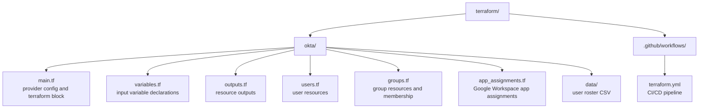

# Terraform

This directory contains Terraform configurations for managing Caira HQ infrastructure as code. Okta is the primary resource target — users, groups, app assignments, and policies are declared here and applied via the Okta provider.

Terraform defines desired state. Okta owns runtime identity. SCIM handles downstream propagation to Google Workspace.

---

## Structure



---

## Usage

### Prerequisites

- [Terraform](https://developer.hashicorp.com/terraform/install) >= 1.0
- Okta API token with sufficient privileges (super admin or custom role with user/group/app management)

### Authentication

The Okta API token is passed via environment variable and never stored in code or committed to the repo:

```bash
export TF_VAR_okta_api_token="your-api-token"
```

### First Run

```bash
cd terraform/okta
terraform init
terraform plan
terraform apply
```

### Adding a New User

Add a row to `data/users.csv` and run `terraform apply`. No code changes required.

---

## CI/CD Pipeline

All Terraform changes are gated through a GitHub Actions pipeline. No infrastructure changes reach production without passing automated checks and explicit approval.

**On Pull Request:**
- `terraform fmt` — validates code formatting
- `terraform validate` — validates configuration syntax
- `terraform plan` — shows exactly what will change before any human reviews the PR

**On Merge to Main:**
- `terraform apply` — automatically applies the approved changes

The pipeline only triggers when files in `terraform/**` are modified — unrelated changes such as documentation updates do not kick off a Terraform run.

Secrets are stored in GitHub Actions repository secrets and injected at runtime. They are never stored in code or committed to the repository.

→ [Pipeline configuration](../.github/workflows/terraform.yml)

---

## User Provisioning

User data is managed via `data/users.csv` rather than hardcoded Terraform resources. Each row represents one user. Terraform reads the CSV and dynamically creates one Okta user resource per row using `for_each`.

This pattern simulates a real HRIS integration — in production, this data would be sourced from an API call to BambooHR, Workday, Rippling, or similar. The CSV is the lab equivalent of that data source.

The CSV includes an intentional subset of user fields — name, login, email, title, organization, department, division, user type and manager. Fields like personal email and phone number are excluded from this public repository as they constitute PII. In a production HRIS integration these fields would be sourced from the HRIS API directly and would never touch a committed file.

Users are created as ACTIVE with a temporary password set via `var.default_temp_password`. The user is forced to change their password on first login. The admin communicates the temporary password to the user directly — no activation email is required or sent.

---

## State

Local state is used in this lab environment. In production, state would be stored remotely — Terraform Cloud, S3 with