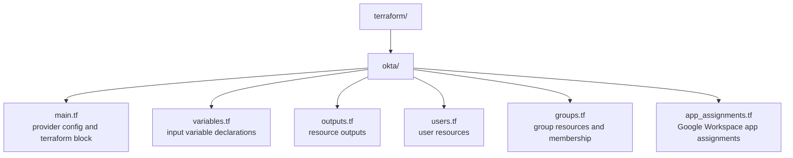

# Terraform

This directory contains Terraform configurations for managing Caira HQ infrastructure as code. Okta is the primary resource target — users, groups, app assignments, and policies are declared here and applied via the Okta provider.

Terraform defines desired state. Okta owns runtime identity. SCIM handles downstream propagation to Google Workspace.

---

## Structure



---

## Usage

### Prerequisites

- [Terraform](https://developer.hashicorp.com/terraform/install) >= 1.0
- Okta API token with sufficient privileges (super admin or custom role with user/group/app management)

### Authentication

The Okta API token is passed via environment variable and never stored in code or committed to the repo:

```bash
export TF_VAR_okta_api_token="your-api-token"
```

### First Run

```bash
cd terraform/okta
terraform init
terraform plan
terraform apply
```

---

## State

Local state is used in this lab environment. In production, state would be stored remotely — Terraform Cloud, S3 with DynamoDB locking, or similar — to support collaboration, state locking, and audit history.

The `terraform.tfstate` file and any `.tfvars` files are gitignored and never committed.

---

## Design Decisions

**Okta as the identity source of truth.** All user accounts are created and managed in Okta via Terraform. No users are provisioned directly in Google Workspace or any downstream service — that is handled by SCIM after Okta receives the resource.

**Secrets via environment variables.** The API token is passed as `TF_VAR_okta_api_token` at runtime. This is the correct pattern for both local development and CI/CD pipelines (GitHub Actions secrets, etc.) — no credentials ever touch the codebase.

**Variables for all org-specific values.** The Okta org name and all environment-specific values are declared as variables and populated via `terraform.tfvars` locally. This keeps the configuration portable and the repo free of environment-specific hardcoding.

---

*Part of [Caira HQ — Platform](../README.md) · Neil Chavez · Creator of things.*