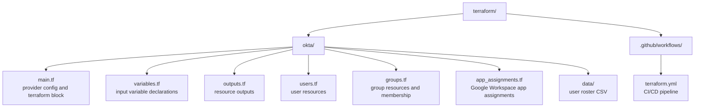

# Terraform

This directory contains Terraform configurations for managing Caira HQ infrastructure as code. Okta is the primary resource target — users, groups, app assignments, and policies are declared here and applied via the Okta provider.

Terraform defines desired state. Okta owns runtime identity. SCIM handles downstream propagation to Google Workspace.

---

## Structure



---

## Usage

### Prerequisites

- [Terraform](https://developer.hashicorp.com/terraform/install) >= 1.0
- HCP Terraform account with access to the `cairahq` organization
- Okta API token with sufficient privileges (super admin or custom role with user/group/app management)

### Authentication

**HCP Terraform** — authenticate the local CLI with HCP Terraform before running any commands:

```bash
terraform login
```

This stores a token locally that allows Terraform to communicate with HCP Terraform for state and runs.

**Okta API token** — stored as a workspace variable in HCP Terraform. For local runs it can also be passed via environment variable:

```bash
export TF_VAR_okta_api_token="your-api-token"
```

### Adding a New User

Submit an onboarding request via the [Caira HQ Identity Management service](https://cairahq-platform-production.up.railway.app). The service reads the current `users.csv` from GitHub, appends the new user row, creates a branch, and opens a pull request automatically. The CI/CD pipeline handles the rest on merge — no manual CSV editing or branch creation required.

For manual changes, add a row to `data/users.csv` and open a pull request directly.

### First Run

```bash
cd terraform/okta
terraform login
terraform init
terraform plan
terraform apply
```

---

## CI/CD Pipeline

All Terraform changes are gated through a GitHub Actions pipeline backed by HCP Terraform. No infrastructure changes reach production without passing automated checks and explicit approval.

**On Pull Request:**
- `terraform fmt` — validates code formatting
- `terraform validate` — validates configuration syntax
- `terraform plan` — shows exactly what will change before any human reviews the PR

**On Merge to Main:**
- GitHub Actions triggers HCP Terraform
- HCP Terraform runs `terraform apply` against the remote state
- A manual confirmation step in HCP Terraform provides a final approval gate before resources are created or modified

The pipeline only triggers when files in `terraform/**` are modified — unrelated changes such as documentation updates do not kick off a Terraform run.

Secrets are stored in HCP Terraform workspace variables and GitHub Actions repository secrets. They are never stored in code or committed to the repository.

→ [Pipeline configuration](../.github/workflows/terraform.yml)
→ [HCP Terraform workspace](https://app.terraform.io/app/cairahq/workspaces/cairahq-platform)

---

## User Provisioning

User data is managed via `data/users.csv` rather than hardcoded Terraform resources. Each row represents one user. Terraform reads the CSV and dynamically creates one Okta user resource per row using `for_each`.

This pattern simulates a real HRIS integration — in production, this data would be sourced from an API call to BambooHR, Workday, Rippling, or similar. The CSV is the lab equivalent of that data source.

The CSV includes an intentional subset of user fields — name, login, email, title, organization, department, division, user type and manager. Fields like personal email and phone number are excluded from this public repository as they constitute PII. In a production HRIS integration these fields would be sourced from the HRIS API directly and would never touch a committed file.

Users are created as ACTIVE with a temporary password set via `var.default_temp_password`. The user is forced to change their password on first login. The admin communicates the temporary password to the user directly — no activation email is required or sent.

Provisioning requests are submitted via the TypeScript onboarding service, which automates the CSV update, branch creation, and PR opening. Terraform remains the only system that directly creates or modifies Okta resources.

---

## State

State is stored remotely in HCP Terraform. This provides:

- **State locking** — prevents concurrent runs from corrupting state
- **Audit history** — every plan and apply is logged with who triggered it and what changed
- **Manual apply gate** — changes can be reviewed in the HCP Terraform UI before being applied to production
- **Team collaboration** — state is accessible to any authorized pipeline or operator, not tied to a local machine

The `terraform.tfstate` file and any `.tfvars` files are gitignored and never committed. All sensitive variable values are stored in HCP Terraform workspace variables.

---

## Design Decisions

**GitOps as the change model.** All infrastructure changes flow through Git. There is no direct console access to create or modify resources — everything is declared in code, reviewed via pull request, and applied through the pipeline. This provides a complete audit trail of every change: who made it, what changed, who approved it, and when it was applied.

**HCP Terraform for remote state and approvals.** State is stored in HCP Terraform rather than locally. This mirrors production patterns where state must be accessible to CI/CD pipelines and protected from local machine loss or corruption. The manual apply gate in HCP Terraform provides a second approval checkpoint beyond the GitHub PR review.

**CSV as HRIS simulation.** User data lives in `data/users.csv` rather than hardcoded variables. Adding a user means adding a row — no code changes. This mirrors how production environments source user data from an HRIS system, keeping the provisioning code generic and the data separate.

**Okta as the identity source of truth.** All user accounts are created and managed in Okta via Terraform. No users are provisioned directly in Google Workspace or any downstream service — that is handled by SCIM after Okta receives the resource.

**Single group for SSO and SCIM.** The `Google Workspace SSO/SCIM` group handles both app access and SCIM provisioning. A single group keeps membership management simple in a single-operator environment — one group assignment covers both access and provisioning. In a larger environment these would be separated to allow finer-grained control over who gets provisioned vs who gets SSO access.

**Admin-set passwords over activation emails.** Users are created as ACTIVE with a temporary password set by Terraform. The admin communicates the password directly rather than relying on an activation email. This avoids the bootstrapping problem where the activation email is sent to a mailbox that doesn't exist until after provisioning completes — a constraint that exists in any environment where the mailbox is a downstream result of the provisioning event itself.

**Secrets via environment variables and HCP Terraform workspace variables.** The Okta API token and other sensitive values are never stored in code. For local development they are passed as environment variables. In the CI/CD pipeline they are injected from HCP Terraform workspace variables. No credentials ever touch the codebase.

**Variables for all org-specific values.** The Okta org name and all environment-specific values are declared as variables and populated via `terraform.tfvars` locally. This keeps the configuration portable and the repo free of environment-specific hardcoding.

---

*Part of [Caira HQ — Platform](../README.md) · Neil Chavez · Creator of things.*