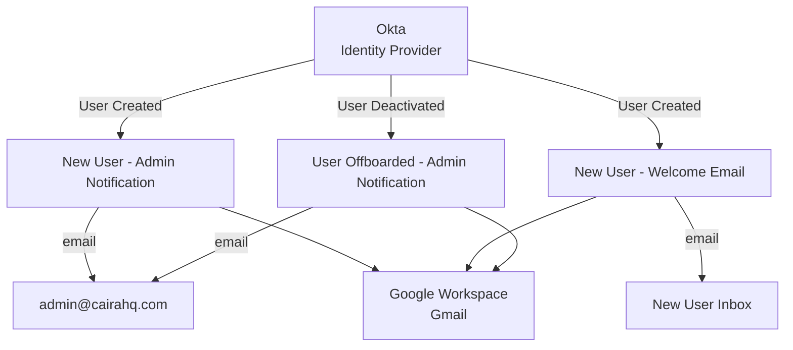

# Okta Workflows

Okta Workflows is a no-code/low-code automation tool native to the Okta platform. It listens for identity events and executes actions across connected systems in response: no polling, no scheduled jobs, no manual triggers.

All flows live in the **Caira HQ** folder within the Okta Workflows console.

---

## Architecture

---

## Flows

### New User - Admin Notification
**Trigger:** User Created in Okta
**Action:** Sends an email to `admin@cairahq.com` with the new user's profile details.

**Email includes:**
- Full name
- Email address
- Title
- Department
- Manager
- User type

**Purpose:** Ensures the IT admin is immediately notified of every new account creation with enough context to verify the provisioning is correct.

---

### New User - Welcome Email
**Trigger:** User Created in Okta
**Action:** Sends a welcome email directly to the new user's `@cairahq.com` inbox.

**Email includes:**
- Personalized greeting
- Login email address
- IT contact information

**Purpose:** Gives every new user immediate confirmation that their account is ready and a clear point of contact for support.

---

### User Offboarded - Admin Notification
**Trigger:** User Deactivated in Okta
**Action:** Sends an email to `admin@cairahq.com` with the deactivated user's profile details.

**Email includes:**
- Full name
- Email address
- Title
- Department
- Manager
- User type

**Purpose:** Ensures the IT admin is immediately notified when access is revoked, with a prompt to complete any remaining offboarding steps.

**Note:** Deactivation — not deletion — is the correct trigger for offboarding notifications. Deactivation is the moment access is revoked. Deletion is cleanup that happens after offboarding is confirmed complete. By the time a user is deleted, their profile data is no longer accessible.

---

## Implementation Notes

**Read User step:** All three flows include an Okta Read User step after the trigger. The trigger event alone does not reliably pass full profile attributes. The Read User step explicitly fetches the complete user profile using the user ID from the trigger. This ensures fields populated by Terraform at provisioning time (title, department, manager, user type) are captured correctly.

**Gmail connector:** Email delivery uses the Gmail connector authenticated as `admin@cairahq.com`. All outbound notifications originate from this address.

**Data retention:** Flow execution history is retained in Okta Workflows. Save data passing through flows is disabled. User profile data is fetched at runtime and not stored within the Workflows platform.
