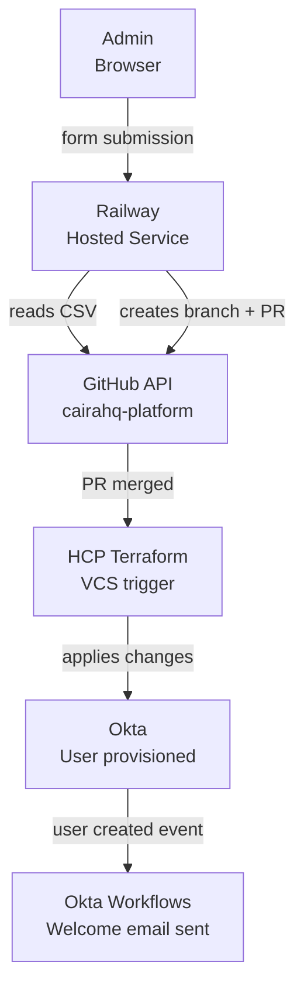

# TypeScript Onboarding Service

A lightweight Express service that provides a web UI for managing user lifecycle in the Caira HQ platform. Built in TypeScript, hosted on Railway, and integrated with GitHub and Terraform to automate identity provisioning.

---

## Why This Exists

User provisioning in Caira HQ is managed by Terraform — the `users.csv` file is the source of truth and every change flows through a GitOps pipeline. This service removes the manual steps of editing the CSV locally, creating a branch, and opening a PR. Instead, an admin fills out a form and the service handles everything up to the PR automatically.

The human approval gate is preserved — no user is ever provisioned without a PR review and merge. The automation handles the repetitive mechanics, not the decision.

---

## Architecture



---

## Stack

| Layer | Tool | Purpose |
|-------|------|---------|
| Runtime | Node.js | Server runtime |
| Language | TypeScript | Type-safe application code |
| Web Framework | Express | HTTP server and routing |
| GitHub Integration | Octokit | GitHub API client |
| Hosting | Railway | Production deployment, auto-deploy on merge |
| Auth | Basic Auth | Access control — production upgrade path is Okta SSO |

---

## Structure

typescript/

├── public/

│   └── index.html          # Web UI — onboard and offboard forms

├── src/

│   ├── index.ts            # Express server entry point, basic auth middleware

│   ├── routes/

│   │   └── onboard.ts      # POST /onboard/add and /onboard/remove handlers

│   ├── github/

│   │   └── client.ts       # GitHub API — read CSV, create branch, commit, open PR

│   └── csv/

│       └── update.ts       # CSV read/write logic, branch name generation

├── .env.example            # Environment variable template

├── package.json            # Dependencies and scripts

└── tsconfig.json           # TypeScript compiler configuration

---

## How It Works

### Onboarding
1. Admin fills out the onboarding form with new hire details
2. Service reads the current `users.csv` from GitHub
3. New user row is appended in the correct CSV format
4. A new branch is created (`feat/onboard-firstname-lastname`)
5. Updated CSV is committed to the branch
6. A PR is opened with the title `Onboard: First Last`
7. Admin reviews and merges the PR
8. HCP Terraform detects the merge via VCS trigger and applies
9. Okta user is created by Terraform
10. Okta Workflows fire — admin notification and welcome email sent

### Offboarding
1. Admin fills out the offboarding form with the user's name and email
2. Service reads the current `users.csv` from GitHub
3. The matching user row is removed
4. A new branch is created (`feat/offboard-firstname-lastname`)
5. Updated CSV is committed to the branch
6. A PR is opened with the title `Offboard: First Last`
7. Admin reviews and merges the PR
8. HCP Terraform detects the merge and applies
9. Okta user is deactivated by Terraform
10. Okta Workflows fire — admin offboard notification sent

---

## Environment Variables

| Variable | Description |
|----------|-------------|
| `GITHUB_TOKEN` | Personal access token with `repo` scope |
| `GITHUB_OWNER` | GitHub username (`neilchvz`) |
| `GITHUB_REPO` | Repository name (`cairahq-platform`) |
| `CSV_PATH` | Path to users CSV (`terraform/okta/data/users.csv`) |
| `BASIC_AUTH_USER` | Username for basic auth |
| `BASIC_AUTH_PASS` | Password for basic auth |

Copy `.env.example` to `.env` and fill in values for local development. Production variables are managed in Railway.

---

## Running Locally

```bash
npm install
npm run dev
```

Service runs at `http://localhost:3000`.

## Deploying

Every merge to `main` triggers an automatic redeploy on Railway. No manual deploy steps required.

---

## Security Notes

**Basic auth** is the current access control mechanism — credentials are required to access the form. This is appropriate for a personal lab environment.

**Production upgrade path:** Replace basic auth with Okta SSO. The service would be registered as an app in Okta, users authenticate via the existing Okta tenant, and only `@cairahq.com` accounts with the appropriate group membership can access it. This closes the loop — the identity platform protects the tool that manages the identity platform.

**PR gate:** Even if someone bypassed auth and submitted a form, no user would be provisioned without a PR review and merge. The GitHub → Terraform pipeline is the final control.